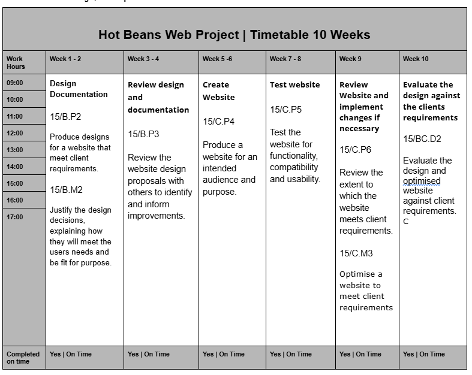
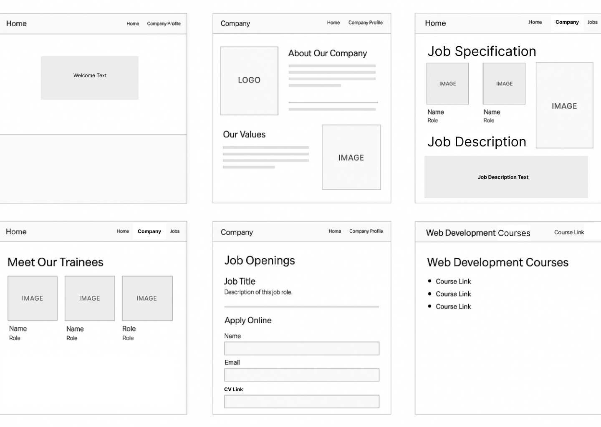
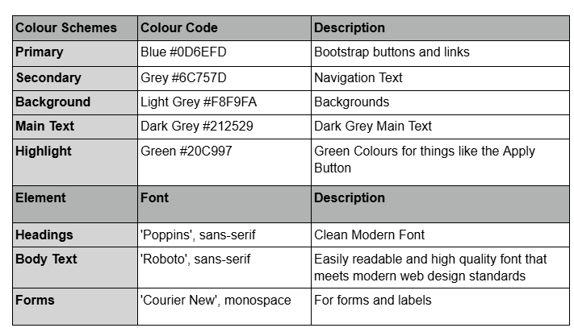

# 15/BC.D3 Demonstrate individual responsibility, creativity and effective self-management in the design, development and review of a website.

# 15/B.P2 Produce designs for a website that meet client requirements.
Design Documentation 

# Hot Beans Recruitment

## Table of Contents
- [1. D3](#15bcd3-demonstrate-individual-responsibility-creativity-and-effective-self-management-in-the-design-development-and-review-of-a-website)
- [2. P2](#15bp2-produce-designs-for-a-website-that-meet-client-requirements)
- [3. M2](#115bm2-justify-the-design-decisions-explaining-how-they-will-meet-the-users-needs-and-be-fit-for-purpose)
- [4. M2](#15bm2-justify-the-design-decisions-explaining-how-they-will-meet-the-users-needs-and-be-fit-for-purpose)
- [4. Evaluation and Improvements](#4-evaluation-and-improvements)
- [4. Evaluation and Improvements](#4-evaluation-and-improvements)
- [4. Evaluation and Improvements](#4-evaluation-and-improvements)
- [4. Evaluation and Improvements](#4-evaluation-and-improvements)
- [4. Evaluation and Improvements](#4-evaluation-and-improvements)

—---
## 1. Design Documentation
### Wireframe

As per the requirements for the website i created wireframes for 5 main pages using figma for Hot Beans Recruitment, covering the following requirements by the client;
● A profile of the company itself
● profiles of existing trainee web developers
● job specifications and required qualifications
● an on-line application form
● links to web development courses

I created them with the use of bootstrap in mind and they should be easily implemented and responsive once created using bootstrap.

### User Flow Diagram

a

# 115/B.M2 Justify the design decisions, explaining how they will meet the users needs and be fit for purpose.

A User Flow Diagram was created using figma to show how a user will navigate the web pages, from the user flow diagram you can see that the first page will be the home page, after that the user can navigate to all other pages as each section will be interconnected for a more user friendly experience, navigation will be smooth and fluid, a decision is then placed at the Job Apply page where if a user applies they will be redirected to the home page and if they do not apply they will be kept on the job apply page unless they chose to navigate elsewhere.

### Client Requirement Analysis
15/B.M2 Justify the design decisions, explaining how they will meet the users needs and be fit for purpose.
The client Hot Beans Web has asked to have a new section on their website with the goal of helping to recruit new trainees as web developers. Because of this the goal of the section will be to have a webpage that will attract people who are already or training to become web developers, these could be people who are training, or already fully qualified and looking for a new challenge.

Hot Beans has also requested that the following is added; 

● A profile of the company itself
● profiles of existing trainee web developers
● job specifications and required qualifications
● an on-line application form
● links to web development courses

Because of this i have come up with a blueprint for a great webpage that should achieve the goal by doing the following;

We will have a homepage (Landing Page) that will have a clean layout and catch the eye of the user with a link to the company page
A Company Page that will tell users what the company is about to make users want to delve deeper into the site

A Trainee Page that will show some current trainees with images, names and roles

A Job Specification page which will list current jobs and their description 

A Job Apply page which will allow users to apply online for a desired role 

A Courses page which will allow users to click on links to online courses that could help them increase their likelihood of being hired and also increase their knowledge base

In addition to this the site will be using the latest version of Bootstrap which will help the site be responsive and fluid in its navigation and help make sure that users using the site are able to navigate easily.

### Colour Schemes and Typography

# 15/B.M2 Justify the design decisions, explaining how they will meet the users needs and be fit for purpose.

These are the choices I made after doing research and looking at other sites, these choices will make sure that the website I create will look sleek, professional and modern which will help users who desire to be website developers to look at the website and see something that will inspire them and make them more likely to apply. This not only helps the website look good but also meet the clients requirements.

The primary will be blue for buttons and links which I think will look nice with the colour scheme I am going for. Then i went with a light grey background and dark grey text which will help give a contrast to things, as someone who is completely color blind, i found these colours easy to read which will help the website be more user friendly and have better accessibility and finally i will use an accent colour for the application button which will be green.

Then for typography i went with poppins for headings and headings text which i think will look nice and modern and i went with roboto for the body text on the website, again for the same reason, these are both clean modern fonts, on top of that they are easy to read which will help the website be more accessible and from my research i found that they meet modern website design standards which means the website will look nice and modern and professional and both fonts are available on google.

All the colours and fonts were also chosen as they will work with bootstrap without creating further issues and make creating the website easier and more streamlines while also making sure it looks professional, clean and modern while being responsive and meeting the clients requirements which is how i justify the decision i have made.

To conclude the decision i have made in the design process will not only meet the clients need but also the users needs and is fit for purpose, it provide the ability to find free courses, learn about the company, their employees and also apply for job openings while also remaining clean and professional which will help both both meet the clients needs and requirements but also the needs and requirements of the user, showing that it is fit for purpose.

15/B.P3 Review the website design proposals with others to identify and inform improvements.
To ensure i meet the clients requirements i made sure to review the design proposals, i did this by emailing a senior web developer within the organisation in order to ensure that my work was up to standard, i emailed them within business hours and according to the project plan i laid out, this helps ensure that i am demonstrating both individual responsibility and effective self management in the development and review of a website

Here you can see the email correspondence I sent which shows professional language while also being polite, explaining what I have provided to streamline the review process and also to ensure that I am demonstrating individual responsibility and effective self management.

Here you can see the reply, the reply stated i needed to change some things with the wireframe as well as a colour in the colour schemes and typography. To show my creativity as well as my effective self management I started on these changes right away.

To add onto this the request was to remove the jobs tab, and i took it upon myself to add a navigation bar/button in order to better optimise the design which shows both my creativity and effective self management in the design of the website and documentation, i also removed the CV link as requested, ensured home was in the top left of all pages and changed the colour of the apply button to blue as requested with the new documentation seen below.

Colour Schemes
Colour Code
Description
Primary
Blue #0D6EFD
Bootstrap buttons and links
Secondary
Grey #6C757D
Navigation Text
Background
Light Grey #F8F9FA
Backgrounds
Main Text
Dark Grey #212529
Dark Grey Main Text
Highlight
Blue #0D6EFD
Blue Colour for things like the Apply Button
Element
Font
Description
Headings
'Poppins', sans-serif
Clean Modern Font
Body Text
'Roboto', sans-serif
Easily readable and high quality font that meets modern web design standards
Forms
'Courier New', monospace
For forms and labels

Here you can see i emailed the senior web developer in order to make sure the changes were up to scratch and also to make them aware of a change i made on my own (Navigation bar/button)

Here you can see that they were happy with the changes made and also thought the navigation button idea was a great idea and since all the design documentation was good after a review and with changes made, I then moved onto creating the website.

15/C.P4 Produce a website for an intended audience and purpose.

Homepage with working apply button

Hover dropdown menu, responsive and all parts work

Company profile page with logo, images and information and a clean layout and accurate information

Trainee page with full names, images and descriptions and a clean layout

Job specification page with names of trainees, image of an example project and full job descriptions.

Apply page that lets you select from available job roles

Web designer role with full job description

Web developer role with full job description

Form validation that will prompt you to enter a name if not entered and double validation for email to ensure a valid email address is entered and once both are entered and email is valid form will submit and validation popup will not activate.

Web courses page with 6 working course links. All links work, short description is also provided

Privacy policy page, with link to access the page integrated into the footer

Working Social media link also integrated into the footer

15/C.P5 Test the website for functionality, compatibility and usability.
Hot Beans Web Project | Test Plan | Browsers
Device Kind
Device Used
OS (Operating System)
Screen Size
Browser
Browser Version
Pass/Fail
Desktop

Desktop

Mobile

Mobile

Tablet

Tablet
Windows PC

Windows PC

Samsung S20 Ultra (Simulated)

IPhone 14 Pro Max

Galaxy Tab S4

IPad Pro
Windows 11

Windows 11

Android

iOS

Android

iOS
2560 x 1440

2560 x 1440

412 x 915

430 x 932

712 x 1138

1024 x 1366
Chrome

Opera GX

Chrome

Chrome

Chrome

Chrome
Version 136.0.7103.94 

Version 133.0.6943.143

Version 136.0.7103.94

Version 136.0.7103.94 

Version 136.0.7103.94 

Version 136.0.7103.94 
Pass

Pass

Pass

Pass

Pass

Pass

Hot Beans Web Project | Test Plan | Functionality
Tested
Expected Results
Actual Results
Pass/Fail
Notes
Homepage

Apply Box

Form Validation

Navbar

Pages

Links
Homepage loads and displays correctly with navbar, content and footer

Selecting box will highlight it and show correct job description

Warning will show if email is not entered correctly or name isn't entered

Navbar is responsive and drops down when hovered over

All pages Load and are responsive

All links load
Loaded as expected

Roles both work as expected and show the correct job description

Works as expected and shows validation messages

Works as expected and is responsive

All of the menu pages load and are responsive

All links load and are working including footer links
Pass

Pass

Pass

Pass

Pass

Pass
1 minor error, footer won't stay at bottom

None

None

None

None

None

Hot Beans Web Project | Test Plan | Functionality
Tested
Expected Results
Actual Results
Pass/Fail
Notes
Alternate test for images

Keyboard Navigation

Colour Contrast

Focus Ring

Scale

Form Labels
All images have correct Alt text

You can navigate using just a keyboard

Text and background have a good contrast

When using TAB, ring clearly highlights what is selected using TAB

Scale increases and decreases with browser zoom

Form Fields are correctly labels with the correct box for the input
All images had the correct alt text

Menu won't drop on tab and you can select role to apply either

Contrast is good and passes at least WCAG AA

Works as expected, ring is clearly visible on all elements

Scale works correctly at all scales

All form boxes work and are correctly labled
Pass

Fail

Pass

Pass

Pass

Pass
Tested using chrome dev tools and inspect

Mostly works with 2 minor errors

Lowest score was 4.5 which was AA rating

None

Max scales tested 25% - 500%

Tested using Accessibility panel chrome

Hot Beans Web Project | Test Plan | Usability
Tested By
Tested
Feedback
Changes Made/To Make
Pass/Fail
Simon Adams (Web Developer)

Simon Adams (Web Developer)

Simon Adams (Web Developer)

Simon Adams (Web Developer)

Simon Adams (Web Developer)
Navigation and Menu

Form

Job Descriptions

Mobile

Font and Readability
“Navigation Menu was good and easy to understand, drop down menu was very responsive

It was hard to see if they were highlighted because of the sites colour scheme

They were good, but the text felt a bit untidy

Responsive and worked very well on my Samsung android

Font was clean, professional and easy to read but colour scheme felt outdated
None

Will decide if we will change colour scheme or the colour of the outline

Will format the text to tidy it up and make it cleaner

None

Will decide if i will change the colour scheme of the website

Pass

Fail

Fail

Pass

Pass

15/C.P6 Review the extent to which the website meets client requirements.

This website was created as a request from Hot Beans Web, the goal and purpose of it was to attract aspiring web developers and designers who had recently finished their training or qualifications or were previously experienced and were looking for a job as a web developer. To do this they asked for a new section to their website. I will now review the project against the clients requirements and after a review will decide if any changes need to be made and if so I will then proceed to optimise the website and do the necessary changes.

Client Requirements
Company Profile
The new section needed to have a dedicated company profile gate, this page was created as company.html using bootstrap and vs code as well as all of the other pages, the page shows users Hot Beans Web’s goals, background, clients and contact information as well as their logo and offices which meets the clients requirements and allows users to learn about Hot Beans Web.
Trainees Profile
The new section needed to have a dedicated trainees page that was created under trainees.html, the page shows images of current trainees as well as a description of the current trainees which helps people connect with them without meeting them but also meets the clients requirements
Job Specifications
The new section needed to have a dedicated jobs specification section, this was created and split between 2 pages under jobs.html apply.html. jobs.html has images of 2 trainees and an example project as well as a description of both the web designer and web developer roles which meet the clients requirements
Apply Section
This was the second part as a requirement was also an online application form, this was created under apply.html, it allows you to select between available roles, and once selected, a drop down will appear giving a full job description along with pay and an online application form at the bottom with working validation to aid accessibility, this along with the jobs.html fully meets the clients requirements.
Course Links
Finally a section needed to have a dedicated to course links, this was created under courses.html and shows working links with small descriptions of 6 free online courses which fully meets the requirements of the client while also giving users help and options for advancing their knowledge and career.

Additional Work
Privacy
This was not a requirement from the client however to ensure that the client is compliant with GDPR and meets regulations, I decided to integrate a privacy policy for GDPR into the footer with a working link, this will help our client meet regulations and be in full compliance with law and regulation as well as help users understand Hot Beans privacy policy which is important and is in my opinion a must have for any reputable web development company.
Social Media
Another thing that I did, that was done to demonstrate my individual responsibility, creativity and effective self-management in the design, development and review of a website was to create an integrated social media icon with a working link that will direct a user to the client's social media account. This is in my opinion important especially in our day and age where social media is integrated into people's lives and as such I ensured to integrate the clients social media into the footer on the opposite side of the privacy policy.
Landing Page
Another thing that I did, that was done to demonstrate my individual responsibility, creativity and effective self-management in the design, development and review of a website was to create a landing page with a small description stating the client is recruiting with an apply button that will redirect them to the application page, apply.html. I did this as some people might be repeat visitors or not want to go through the whole page and just want to apply, this will help users and returning users save time but also have a nice, clean professional landing page that won't bombard a user with company information which further helps meet the clients requirements in my opinion.
Target audience and Purpose
The new section I made uses a simple, yet clean and responsive navigation design that is accessible to all kinds of users

The content on the pages, like pictures and descriptions and resources are catered around developers of all levels but easily understandable by users who have only recently passed their training and qualifications.

The new section works on multiple devices and operating systems while remaining responsive and working well

The online application has tooltips and live error notifications to help accessibility issues while also making the application process simpler

Places to Improve
The main places to improve are going to be where issues were found in testing, these improvements are;

Footer won't stay at the bottom of the page

This can be fixed and improved by fixing the code to ensure the bar stays at the bottom of the page always

When using the keyboard only. Menu won't drop on tab and you can select role to apply either

This can be fixed and improved by fixing the code and ensuring the menu is also clickable not just hoverable and roles can be selected with a keyboard

Job roles to apply for were hard to see if they were highlighted because of the sites colour scheme

This can be fixed by either changing the sections colour scheme or by making the highlight darker to ensure better visibility

 Text felt a bit untidy

This can be fixed and improved by fixing the code and ensuring the text is formatted/aligned correctly

Colour scheme felt outdated

This can be fixed by changing the colour scheme however it was a personal opinion and other users might feel different, however because of the highlighted job roles it might be worth it to change the colour scheme
Conclusion
To conclude my review i believe that the site does meet the clients requirements to the fullest extent, the website is smart, professional and clean, it is functional and has the correct content to meet the clients requirements with elements that help the site be responsive and feel professional, it is also easy to navigate and understand, user friendly and very accessible. However, as mentioned there are improvements and optimisations that could be made to further improve the site based on feedback from users and testing.

15/C.M3 Optimise a website to meet client requirements
To optimise the website i decided to address 2 issues with job roles and colour scheme and decided to try and make the colour schemes more modern as well as the typography, changes will be shown in RED

Colour Schemes
Colour Code
Description
Primary
Dark Blue #0F0F1C
Main Background
Secondary
Dark Grey #1A1A2E
Panels and cards
Accent Gradient
Neon from pink #F81CE5 - purple #7928CA - blue #0070F3
Will use linear-gradiant and find the right setting
Secondary Text
Light Grey #A1A1A1
For Descriptions and other text
Main Text
Plain White #FFFFFF
For Main and Heading Text
Border
Charcoal Grey #2C2C3A
Borders and outlines
Highlight
Blue #0070F3
For Hovers and Links
Accent Gradient 2
Blue #0d0d1f - #1a1a2e (Gradiant)
Added a glow in the top right to give a more modern look
Element
Font
Description
Headings
'Poppins', sans-serif
Clean Modern Font
Body Text
'Roboto', sans-serif
Easily readable and high quality font that meets modern web design standards
Forms
'Roboto Mono', monospace
For forms and labels, modern and keeps things uniform
Buttons
'Poppins', sans-serif
Clean Modern font and will stand out and keep things uniform

Optimisations Made

I Completely revamped the theme, made it a dark theme, more modern and sleek

Made Course links and hoverable buttons pop out when hovered and change colour for better contrast and make them easier to see and improve accessibility

Added Gradients for a more modern sleep feel, not a blocky older (Old microsoft) feel

Changed Text of Hot Beans Web Recruitment to poppins to make it look nicer and not as blocky and unbalanced

Added Logo to the left of Hot Beans Web Recruitment to make it look nicer and more professional

Updated .btn-light to make menu button look nicer and match the theme better and aid accessibility (Changed colour, added border and weight to font and a border radius, made button rounder (10px))

Made the menu stay on top any images or cards when extended

Made images have rounded corners to make them fit in more with the new sleek theme

Justify Align text to make things look tidier and more professional 

Collapsed the box for descriptions in trainees and made it a clickable read more box with a stylish arrow

Made footer stay at the bottom of the page

Added accessibility to menu so that it works with work with keyboard

Added accessibility to read more arrow to work with keyboard

Added accessibility to web designer and web developer jobs on apply page to work with keyboard

Forced menu dropdown to the right on smaller screens like mobile

Fixed image scaling to fit ipad, tablet, smartphone and desktop screens and be aligned properly

15/C.P5 Test the website for functionality, compatibility and usability.
Hot Beans Web Project | Post Optimisation | Test Plan | Browsers
Device Kind
Device Used
OS (Operating System)
Screen Size
Browser
Browser Version
Pass/Fail
Desktop

Desktop

Mobile

Mobile

Tablet

Tablet
Windows PC

Windows PC

Samsung S20 Ultra (Simulated)

IPhone 14 Pro Max

Galaxy Tab S4

IPad Pro
Windows 11

Windows 11

Android

iOS

Android

iOS
2560 x 1440

2560 x 1440

412 x 915

430 x 932

712 x 1138

1024 x 1366
Chrome

Opera GX

Chrome

Chrome

Chrome

Chrome
Version 136.0.7103.94 

Version 133.0.6943.143

Version 136.0.7103.94

Version 136.0.7103.94 

Version 136.0.7103.94 

Version 136.0.7103.94 
Pass

Pass

Pass

Pass

Pass

Pass

Hot Beans Web Project | Post Optimisation | Test Plan | Functionality
Tested
Expected Results
Actual Results
Pass/Fail
Notes
Homepage

Apply Box

Form Validation

Navbar

Pages

Links
Homepage loads and displays correctly with navbar, content and footer

Selecting box will highlight it and show correct job description

Warning will show if email is not entered correctly or name isn't entered

Navbar is responsive and drops down when hovered over

All pages Load and are responsive

All links load
Loaded as expected

Roles both work as expected and show the correct job description

Works as expected and shows validation messages

Works as expected and is responsive

All of the menu pages load and are responsive

All links load and are working including footer links
Pass

Pass

Pass

Pass

Pass

Pass
none

None

None

None

None

None

Hot Beans Web Project | Post Optimisation | Test Plan | Functionality
Tested
Expected Results
Actual Results
Pass/Fail
Notes
Alternate test for images

Keyboard Navigation

Colour Contrast

Focus Ring

Scale

Form Labels
All images have correct Alt text

You can navigate using just a keyboard

Text and background have a good contrast

When using TAB, ring clearly highlights what is selected using TAB

Scale increases and decreases with browser zoom

Form Fields are correctly labels with the correct box for the input
All images had the correct alt text

You can navigate all sections with tab

Contrast is good and passes at least WCAG AA

Works as expected, ring is clearly visible on all elements

Scale works correctly at all scales

All form boxes work and are correctly labled
Pass

pass

Pass

Pass

Pass

Pass
Tested using chrome dev tools and inspect

none

Lowest score was 4.5 which was AA rating

None

Max scales tested 25% - 500%

Tested using Accessibility panel chrome

Hot Beans Web Project | Post Optimisation | Test Plan | Usability
Tested By
Tested
Feedback
Changes Made/To Make
Pass/Fail
Simon Adams (Web Developer)

Simon Adams (Web Developer)

Simon Adams (Web Developer)

Simon Adams (Web Developer)

Simon Adams (Web Developer)
Navigation and Menu

Form

Job Descriptions

Mobile

Font and Readability
“Navigation Menu was good and easy to understand, drop down menu was very responsive

Easy to see, read and understand

They were good, text is now aligned well

Responsive and worked very well on my Samsung android

Font was clean, professional and easy to read, i loved the dark theme, the website was very pleasing
None

Website looks much better and more modern afer colour change

Text was all aligned well

None

Website is sleek and modern after change

Pass

pass

pass

Pass

Pass

15/C.P4 Produce a website for an intended audience and purpose.

Homepage with working apply button

Hover dropdown menu, responsive and all parts work

Company profile page with logo, images and information and a clean layout and accurate information

Trainee page with full names, images and descriptions and a clean layout, added arrows to make the boxes hide the amount of information unless a user wants to see and made it look more modern

Job specification page with names of trainees, image of an example project and full job descriptions.

Apply page that lets you select from available job roles

Web designer role with full job description

Web developer role with full job description

Form validation that will prompt you to enter a name if not entered and double validation for email to ensure a valid email address is entered and once both are entered and email is valid form will submit and validation popup will not activate.

Web courses page with 6 working course links. All links work, short description is also provided

Privacy policy page, with link to access the page integrated into the footer

Working Social media link also integrated into the footer

15/BC.D2 Evaluate the design and optimised website against client requirements.

Final Evaluation

This project was a delight to work on and really enjoyable however with that being said to have a strong evaluation its important to go back and look at the strengths and weaknesses of the website
Strengths
First let's look at the strengths

All requirements were met and all features are built into the site

Modern, dark themed design which has a consistent colour theme

Responsive layout that was tested on multiple devices and browsers

Application form with live validation checks

Clean, modern expandable sections

Website is very accessible and provides features like a good contrast and keyboard navigation
Weaknesses
Now lets look at the weaknesses

There were difficulties with spacing in some areas and alignment on tablet devices, in particular ipad models

Images are not 100% the intended size and aligned to my satisfaction

Some parts of the site use custom styles which could cause issues down the road
Future improvements
Finally lets look at where we can improve for next time.

I could use fancier, more advanced things like animations and transitions to make the website more interactive and fun to use

I could implement a better form submission with more options

Improved submission handling

I Could create user accounts so that applications could be logged and tracked

After looking at my original work and then the changes that I made I can say with confidence that the final version of the Hot Beans Web website meets all of the clients requirements that were outlined for my project. The site has all of the content asked of the client and more, it has an easy to understand and clean company profile, a trainees profile page with images and descriptions so users can get a good understanding as well as interactive text boxes that help the text not clutter the entire screen line the original design. 

There is a detailed job specifications page that outlines the work employees carry out and also an online application that provides boxes to select for the job description as well as a form with live validation and finally a courses page that provides a number of free online courses for those who wish to learn and improve their skill base and knowledge.

Accessibility, responsiveness and compatibility were key factors when creating this site, the website uses bootstrap and is very responsive but also has accessibility features like being able to use it on just a keyboard as well as a good colour contrast and strong fonts that help the site be easily readable for the visually impaired.

The site was also tested on multiple devices, different browsers, different operating systems and different types of devices like tablets, smartphones, i pads and desktops, all resolutions adjust depending on the device thanks to bootstrap's grid system and the adjustments made in the code which provides a consistency regardless of the device the site is being viewed on.

